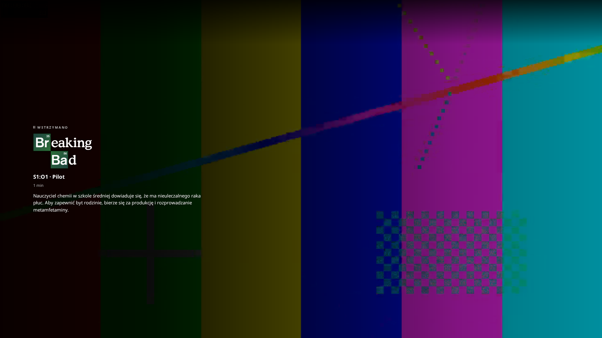
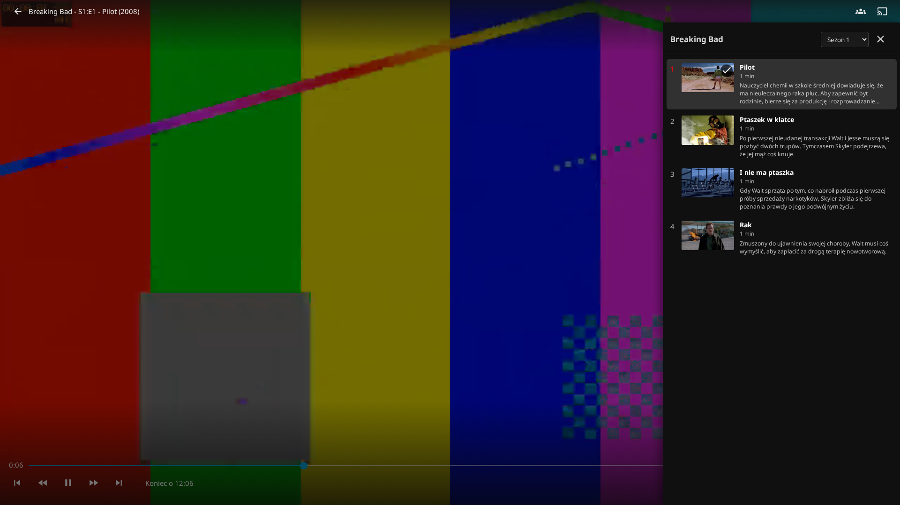
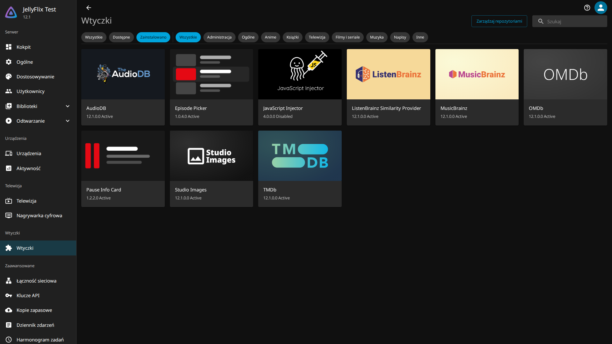

# JellyFlix

*[Polski](README.pl.md) · **English***

Two plugins for the **Jellyfin 12.x** web client that bring a couple of things over from the way
Netflix behaves. Install them from Jellyfin's own plugin catalogue; there is nothing to paste
anywhere and nothing to edit on the server.

| | |
|---|---|
| **Pause Info Card** | Pause playback and the film or series logo, the episode title and the synopsis fade in over the frame. |
| **Episode Picker** | While a series is playing, a button in the player opens a drawer with the current season's episodes and a season selector. Picking one starts it. |





## Requirements

* **Jellyfin 12.0 or 12.1** (plugin ABI `12.0.0.0`). Built and tested against `jellyfin/jellyfin:12.1`.
* A browser, or **Jellyfin Desktop 1.11 or newer** — from that version it loads the web client from
  the server, so the plugins reach it too. Older versions render a copy bundled inside the
  application, which no server-side plugin can touch.
* Native clients (Jellyfin for **Android TV**, Kodi, Infuse) run no web code at all — no `index.html`
  to inject into and no CSS — so nothing here can reach them. On an Android TV box there is a way
  round it: see [Android TV](#android-tv).

## Install

1. Dashboard → Plugins → **Repositories** → **+**, and add:

   ```
   https://raw.githubusercontent.com/TerminatorXL/JellyFlix/main/manifest.json
   ```

2. Catalogue → install **Pause Info Card**, **Episode Picker**, or both.
3. **Restart the server.** Jellyfin does not load a plugin until it restarts — before that everything
   looks installed and nothing works.
4. Dashboard → Plugins → the plugin's name for its settings.

The two are independent: install either, or both.



## Android TV

The **Jellyfin for Android TV** app is native Kotlin with its own interface. It loads no web client,
so no server-side plugin can reach it — not these, and not Custom CSS either. That is architectural,
not a gap waiting to be filled.

There is a way round it, because **Jellyfin for Android** — the *mobile* app — is a WebView wrapper
that loads the web client from your server. Sideload it on the box and it runs exactly the same code
a browser does, plugins included.

1. Sideload **Jellyfin for Android** (the mobile app, not the Android TV one) onto the box.
2. In its settings: **Video player → Video player type → Web player**. This matters: *Integrated
   player* hands playback to ExoPlayer and leaves the web client, so the OSD the plugins attach to is
   never on screen.
3. In Jellyfin: **Settings → Display → Layout → TV**, so the client lays itself out for a remote.

Then the remote works the way you would expect: the picker opens from the player's button, Up/Down
walks the episode list, Left/Right changes season on the selector without seeking the video, Enter
starts the episode, Back closes.

Verified with `tools/tv-remote-check.mjs --profile android-webview` — the TV layout under an Android
WebView user agent, driven by the keyboard alone, which is as close as a test rig gets without the box
on the desk. Playback in a WebView is not ExoPlayer, so expect the codec support of the browser rather
than of the native app; that is the trade for having the plugins at all.

## Settings

Each plugin has its own page in the Dashboard. Saving takes effect on the next page load — no restart.

**Pause Info Card** — how long the pause has to last before the card appears (350 ms by default; a
shorter pause is almost always a seek), whether to dim the whole frame, whether to use the logo
image, the synopsis, and how much of the file is left. It also carries three CSS hooks that do
nothing on their own but let a stylesheet of yours do more: `data-jfx-row` names the home rows,
`--jflix-scroll` publishes the scroll position, and `data-jfx-overview`/`-genres`/`-runtime` put card
metadata into the DOM.

**Episode Picker** — thumbnails, synopses and their length.

Anything not in the Dashboard can still be changed per browser from the console, and it is remembered:

```js
JellyFlixAddon.setConfig({ pauseInfo: { delayMs: 800 } })
JellyFlixAddon.setConfig({ debug: true })     // [JellyFlix] tracing in the console
JellyFlixAddon.setConfig(null)                // forget the stored overrides
```

## Themes

Both overlays read the [Abyss](https://github.com/AumGupta/abyss-jellyfin) theme's palette when it is
installed — accent, glass tint, corner radius and easing come from its `--abyss-*` variables, so the
drawer looks like the rest of that theme rather than like a stranger dropped on top of it. Each one
falls back to the plugin's own value, so nothing changes without Abyss. The frosted backdrop is the
exception: it is applied *only* when Abyss defines the blur, because it is expensive on a TV and
nobody should pay for it unless they already opted in.

Set your own accent and the drawer follows it — Abyss takes it as R, G, B:

```css
:root { --abyss-accent: 229, 9, 20; }
```

Anything else is ordinary Custom CSS: the plugin stylesheets are injected as the *first* child of
`<head>`, which makes them the weakest sheet on the page, so any `.jfx-pause*` or `.jfx-eps*` rule
you write wins at equal specificity.

## When something does not show up

Each plugin answers a status URL that says whether it is injecting its script and, when it is not, why:

```
https://your-server/PauseInfoCard/status
https://your-server/EpisodePicker/status
```

```json
{"plugin":"Pause Info Card","version":"1.2.2.0","enabled":true,
 "indexRequestsSeen":1,"injected":1,"lastOutcome":"injected"}
```

* **404** — the plugin is not running. Almost always a server that was not restarted after the install.
* **`injected: 0`** — it is seeing the page and declining to touch it; `lastOutcome` says why.
* **`injected` above zero but nothing on screen** — the server side is fine; turn on *Console logging*
  in the plugin's settings and look for `[JellyFlix]` lines in the browser console.

## How it works

jellyfin-web 12.1 has **no hook for custom JavaScript** — Custom CSS is the only thing the Dashboard
takes. So each plugin is a real Jellyfin plugin that does two things:

* an `IStartupFilter` whose middleware appends one `<script>` tag to `index.html` as it is served.
  Nothing on disk is touched, so a server upgrade cannot undo it and the read-only web root in the
  Docker image is not in the way;
* an API controller that serves the script, with the Dashboard settings prepended to it.

Both plugins carry the same JavaScript core. The second one to load detects the first and registers
only its own modules instead of replacing it, which is what lets them coexist on one page.

There is no telemetry and nothing is sent anywhere. Every request goes to the Jellyfin server you are
already logged into, authenticated with the token the web client already holds. All of them are reads
except one: picking an episode POSTs a play command to your own session, because that is the only way
an injected script can start playback.

## Building it yourself

Node and Docker; nothing else has to be installed. Jellyfin 12.1 targets **net10.0**, which is newer
than most machines' SDK, so the C# compiles in the official container.

```bash
npm run build:bundles                              # the JavaScript, one bundle per plugin
npm run build:plugin -- --plugin pause-info-card --version 1.2.2.0
npm run build:plugin -- --plugin episode-picker  --version 1.0.4.0
```

Each build writes `dist/plugin/<slug>_<version>.zip` and refreshes `manifest.json` with the source
URL and its MD5, so the repository URL above keeps working straight after a push.

Adding a third plugin means adding a directory under `plugins/` with a `plugin.json` beside its C#
project — the build script and the manifest already handle any number of them.

### Checks

They drive a real browser against a real Jellyfin, through the Playwright container:

```bash
tools/pw.sh tools/addon-check.mjs --server    # the pause card, as the server delivers it
tools/pw.sh tools/picker-check.mjs            # the drawer: seasons, episodes, switching episode
tools/pw.sh tools/coexist-check.mjs           # both plugins installed at once
```

## Without the plugins

`dist/jellyflix-addon.user.js` is the same code as one file for a userscript manager
(Tampermonkey, Violentmonkey) — per browser, no server changes. `addons/README.md` is the developer
documentation: the module contract, what the core offers, and the reasoning behind the parts that
look odd.

## Licence

MIT. An independent project, inspired by how Netflix behaves; it contains none of Netflix's logos,
fonts or artwork and is not connected with them.
